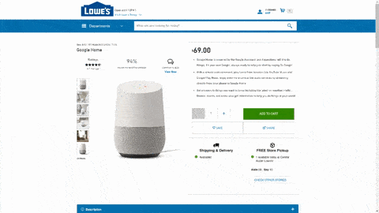
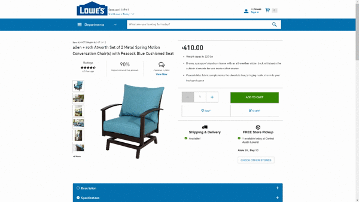
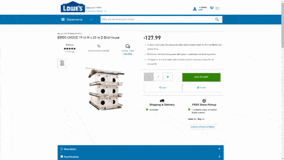
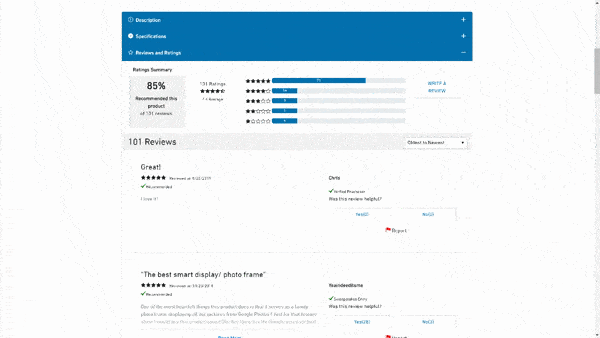
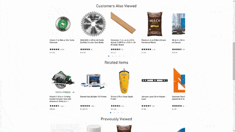

# Lowe's Mock

This imitation of the Lowe’s website is meant to create a comfortable product browsing experience for customers that would like to research products before going to a brick and mortar location.

Upon item selection from the search bar, users can expect to see photos of an item as well as price, reviews by other customers, specs, and a description. They can also browse related items from their initial search, select another item and start the process over. Once the user finds a product that they have interest in, they can save the item to their favorite list or put it in their shopping cart. The application leverages cookies to maintain the persistence of the Favorites List, Shopping Cart, and Previously Viewed Items Carousel upon logging in.

### Contributors
  - [Evelyn Binkard](https://github.com/evelynbinkard)
  - [Mitchell Dill](https://github.com/MitchellDill)
  - [Chris Fauries](https://github.com/chrisfauries)
  - [DJ Park](https://github.com/dongjae93)

### Related Projects

  - [Product Description microservice](https://github.com/mc-ed/Product-Description)
  - [Product Overview microservice](https://github.com/mc-ed/Product-Overview)
  - [Search & Nav Bar microservice](https://github.com/mc-ed/Search-Banner)
  - [Carousel microservice](https://github.com/mc-ed/Carousel)

### Client Deliverables

We presented a streamlined UX highlighting product search, expanding upon the extant Lowe’s online experience. We based our design decisions on the following user stories:

  - I want to see a layout that is familiar and inviting to me
  - I want to be able to search items by name, keyword, and category
  - I want a comparable experience when I visit this website from my phone or computer
  - I expect my shopping cart to persist, even when I close my browser
  - I expect to see a variety of product images whenever I visit a particular product’s page
  - I want to be able to zoom in on product images to inspect the product like I could in-store
  - I expect to have the most pertinent product info relayed in a coherent manner without requiring me to dig through menus
  - I want to have extensive product info relegated to an easily accessible menu elsewhere on the page
  - I’d like to see FAQs about any given product
  - I want to know how satisfied, on average, this product has left prior purchasers
  - I’d like to see user-shared anecdotes and reviews pertaining to the product I’ve searched
  - I want my viewing history to be stored and available to me in an easily understood format
  - I want to see similar items to my search displayed for me in an unobtrusive manner
  - I want to know what customers with similar tastes as me are viewing
  - I don’t expect to see my carousel cluttered with repeats of the same items, regardless of how many times I’ve viewed those items

### Tech Stack

                                                                                         

### Challenges Faced

#### Deployment:
I expected deploying production to be a challenge because it was new to us. I deployed my local server using pm2 and it was difficult to trouble-shoot and navigate through this novel process. I used a fairly detailed step-by-step process found on Hackernoon, but it also assumed some knowledge that I didn’t have yet. I deployed my proxy server using Docker and Elastic Beanstalk and found it to be more accessible. I learned a lot about Security Shells, keys, VM instances, Docker images.

#### Styling:
As a sort of anti-challange, or sighted-and-pre-empted challenge: our team’s early decision to style all of our microservices uniformly using Bootstrap was one which paid dividends. We avoided the style conflicts which can often plague service-oriented-architecture design, and had relatively few issues bringing our microservices together in the reverse proxy using styled components.

#### Authentication:
I did not expect implementing an authentication feature and having a persistent favorite/cart item list would be a challenge. I had prior experience with setting a cookie on request header and thought authentication was simply adding a username and password to the database. When I started to implement the login feature, I quickly realized that I needed to come up with a way to set the cookie only once whenever a user visits the page. Originally, I had a cookie set on the request header for every single get request that came to the server. Because of the nature of asynchronous API calls, when our app mounts it sends a couple of different API calls to the server. These requests happened before the initial request to the server came back with a cookie on its response. As a result, all requests which weren't the initial request did not have a cookie set on their request header, and the server set different cookies on each request. I had to change both the front and back ends to set the cookie on the request header once the app component was mounted, then send its first API call to the server to get cart items. Because of the challenge I faced in the process, I am now confident I'd be able to implement authentication on any full-stack application.

### App Usage

When a user visits the website, they are taken to a splash page that asks them to being their search by entering a search term or selecting a category from the list. Behind the scenes this is a very similar program to the search bar that they see after they enter the main part of the application. 

Their search will take them to a page that displays the item they searched for. We made use of custom window event listeners that communicate the item display to each microservice. Each microservice then uses individual databases and queries to fetch the relevant data. 

The item detail and customer review section made use of individual MongoDB databases and the search bar and item carousels each used PostgreSQL databases. The item detail microservice retrieves ratings and recommendations through an API to the ratings microservice. 

The user can also click on the Community Q and A icon to automatically scroll to and open the Q and A section that relates to the item. This feature makes use of React-scroll and another custom event listener to simulate a click on that section. 

When the user clicks on a thumbnail image, a React Modal element renders and allows the user to hover over the image to zoom in. 

The user can increase (or decrease if the current quantity is greater than 1) the quantity of products to order. This demonstrates communication between our loosely-coupled components.

Another example of interactivity between micro-services, the user can favorite an item and if they are signed in, the item will store across sessions for them to see.

The user can find out more about the product by browsing the accordion style modal under the details. Official specifications about the product is static but the user can interact with community feedback through the 'Reviews' and 'Q&A' sections.

The guide the user to other relevant items, various carousels show an assortment of products that the user might have an interest in visiting.

### Research Required:

  - Deployment
  - SOA - communication between components without compromising their independence
  - Data scraping
  - Bootstrap, react-slick carousel
  - How to set up proxy servers

### Future Refactoring:

  - Scale database size to acommodate for greater inventory
  - Category-specific carousel--similar to Lowes.com's unique, conditional 4th carousel
  - General code readability and separation of reusable components

